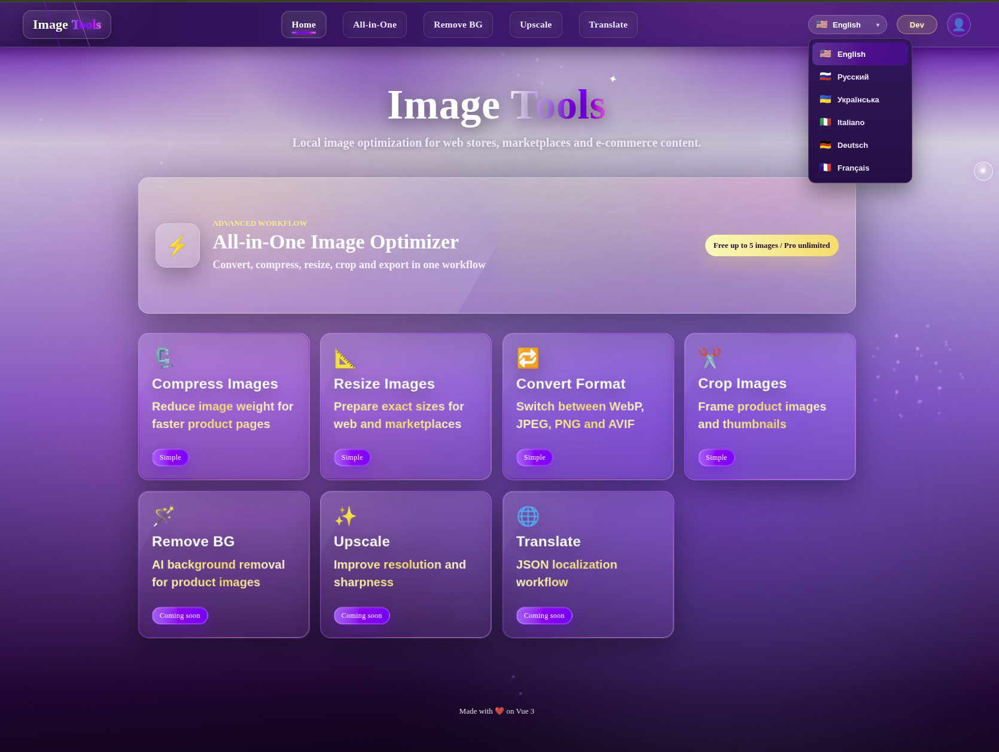
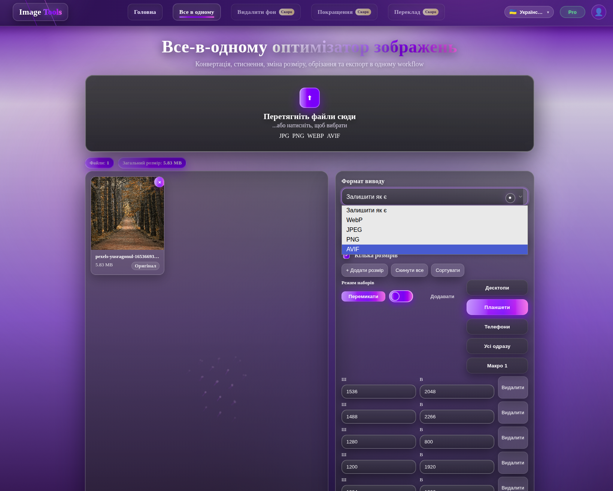

# Image Tools

Local image optimization toolkit built with Vue, TypeScript, and Node.js.

Image Tools is a desktop-ready image preparation app focused on practical workflows for web stores, marketplaces, and e-commerce content. The project is designed around local-first processing where possible, with a foundation for future Free, Pro, Local, and development modes.

## Features

- Image compression
- Image format conversion
- Image resizing
- Image cropping
- All-in-One Image Optimizer workflow
- Batch image processing
- Web and e-commerce oriented image preparation
- Home page with tool cards, workspace interactions, and a dock-style quick workspace
- Local processing concept for handling files on the user's machine where possible
- Experimental local/dev tools:
  - Remove Background
  - Upscale Images
  - JSON Translate

## App Modes

The project includes an early app mode foundation for:

- `local` - local desktop/dev-oriented usage
- `development` - development and preview workflows
- `free` - future free product tier
- `pro` - future paid product tier

Free/Pro mode support is currently a product and UI foundation, not a complete licensing, payment, or entitlement system.

## Tech Stack

- Vue 3
- TypeScript
- Vite
- Vue Router
- Node.js
- GSAP
- Three.js

## Project Status

This project is under active development. It is being prepared for future desktop packaging and commercial product separation, but it should not yet be treated as production-ready software.

Remove Background, Upscale Images, and JSON Translate are experimental local/dev features and may become planned commercial features later.

## Planned Features

- Desktop packaging with an Electron or Tauri-style shell
- Clearer platform adapters for file system and download behavior
- More complete Free/Pro feature limits
- Improved workspace persistence for pinned and docked tools
- Better separation between UI, image processing, and platform-specific code
- More robust export presets for web, marketplace, and e-commerce workflows

## Development Setup

Install dependencies:

```bash
npm install
npm --prefix client/client install
```

Run the frontend development server:

```bash
npm --prefix client/client run dev
```

Build the frontend:

```bash
npm --prefix client/client run build
```

Preview the frontend build:

```bash
npm --prefix client/client run preview
```

## Scripts

Root scripts:

```bash
npm run start
npm run dev:client
npm run dev:server
```

Frontend scripts:

```bash
npm --prefix client/client run dev
npm --prefix client/client run build
npm --prefix client/client run preview
```

## Notes

- The app is currently optimized for iterative local development.
- Desktop packaging is planned but not implemented yet.
- Free/Pro modes are not security features and should not be treated as entitlement enforcement.
- Some advanced tools are experimental and intended for local/development use while the product direction is being refined.

## Demo

### Main UI


### Processing Example

